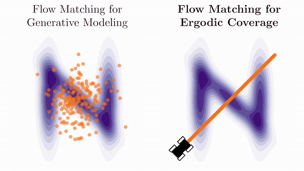

# Linear Quadratic Flow Matching for Ergodic Coverage

</img>

This repository contains implementations for the paper [**"Flow Matching Ergodic Coverage"**](https://arxiv.org/abs/2504.17872), presented at [Robotics: Science and Systems (RSS) 2025](https://roboticsconference.org/).

This repository is under active development, stay tuned for more!

## Tutorials

All the tutorials are implemented using [`jax`](https://github.com/jax-ml/jax). We use [`lqrax`](https://github.com/MaxMSun/lqrax/tree/main) to solve the continuous time Riccati equation for the LQ flow matching problem and [`ott`]() for Sinkhorn divergence.

- [[Notebook](https://github.com/MurpheyLab/lqr-flow-matching/blob/main/tutorials/stein_flow_coverage.ipynb) | [Google Colab](https://colab.research.google.com/github/MurpheyLab/lqr-flow-matching/blob/main/tutorials/stein_flow_coverage.ipynb)] 2D coverage using Stein variational gradient flow with the second-order point-mass dynamics
- [[Notebook](https://github.com/MurpheyLab/lqr-flow-matching/blob/main/tutorials/stein_flow_coverage_diffdrive.ipynb) | [Google Colab](https://colab.research.google.com/github/MurpheyLab/lqr-flow-matching/blob/main/tutorials/stein_flow_coverage_diffdrive.ipynb)] 2D coverage using Stein variational gradient flow with the differential-drive dynamics
- [[Notebook](https://github.com/MurpheyLab/lqr-flow-matching/blob/main/tutorials/sinkhorn_flow_coverage.ipynb) | [Google Colab](https://colab.research.google.com/github/MurpheyLab/lqr-flow-matching/blob/main/tutorials/sinkhorn_flow_coverage.ipynb)] 2D coverage using Sinkhorn divergence flow with the second-order point-mass dynamics
- [[Notebook](https://github.com/MurpheyLab/lqr-flow-matching/blob/main/tutorials/sinkhorn_3d_coverage.ipynb) | [Google Colab](https://colab.research.google.com/github/MurpheyLab/lqr-flow-matching/blob/main/tutorials/sinkhorn_3d_coverage.ipynb)] 3D coverage using Sinkhorn divergence flow with the 3D aircraft dynamics

*Please also checkout [Ergodic Control Sandbox](https://github.com/MurpheyLab/ergodic-control-sandbox) for implementations of other ergodic control methods.*

## Copyright and License

The implementations contained herein are copyright (C) 2024 - 2025 by Max M. Sun and Todd Murphey and are distributed under the terms of the GNU General Public License (GPL) version 3 (or later). Please see the LICENSE for more information.

Contact: Max ([msun@u.northwestern.edu](msun@u.northwestern.edu))
